# 🛒 Multi-Vendor eCommerce Platform (Laravel 12 + React + Inertia.js)

A modern, full-stack **Multi-Vendor eCommerce Website** built using:

- **Backend**: Laravel 12 (API-first approach, Filament Admin, Stripe)
- **Frontend**: React + Inertia.js + TypeScript
- **Features**: Product variations, cart, checkout, vendor management, role-based access, and more!

> ⚠️ This project is currently in **Phase 1** and under active development.

---

## ⚙️ Tech Stack

| Layer       | Technology                               |
| ----------- | ---------------------------------------- |
| Backend     | Laravel 12, PHP 8.x                      |
| Frontend    | React.js, Inertia.js, TypeScript         |
| Admin Panel | [Filament PHP](https://filamentphp.com/) |
| Payments    | Stripe                                   |
| Styling     | Tailwind CSS                             |
| Auth        | Laravel Breeze                           |
| Roles & Permissions | Spatie Laravel Permission        |
| Media Handling       | Spatie Media Library            |

---

## ✅ Features Implemented (Phase 1)

- 🔒 User authentication (register/login/logout)
- 🛍️ Shop page with product listings
- 📦 Product variations with images
- 🔄 Guest cart + cart transfer on login
- 🛒 Add to cart and cart management
- 💳 Stripe payment integration
- 👤 User profile page
- 🛠️ Admin dashboard (using Filament)
- 🛠️ Vendor dashboard (using Filament)
- 🏷️ Role-based access (Spatie Permissions)
- 📁 Product management (admin/vendor)
- 🖼️ Media uploads with Spatie Media Library

---

## 🚧 Upcoming Features (Planned)

- 🧾 **Expanded Admin & Vendor Management Panels**
- 💸 **Vendor payouts and earnings management**
- 🌟 **Wishlist functionality**
- 🏠 **Complete homepage with banners, offers, and featured sections**
- 🛍️ **Advanced shop filters (variant, brand, etc)**
- 📊 **Sales analytics for admin and vendors**
- ⭐ **Product reviews and ratings**
- 🧰 **Product variation type management from admin**
- 🔖 **Discount & promotional pricing features**
- 🎨 **Product UI improvements: badges, availability, and quick views**
- ⚙️ **Complete dynamic CMS-driven management from admin**

---

## 🛠️ Project Setup

### Backend (Laravel)

```bash
git clone https://github.com/your-username/your-repo.git
cd backend
composer install
cp .env.example .env
php artisan key:generate
php artisan migrate --seed
php artisan serve
```

### Frontend (React + Inertia)

```bash
cd frontend
npm install
npm run dev
```

### Screenshots

#### 🏠 Home Screens

##### 🏠 Home Page
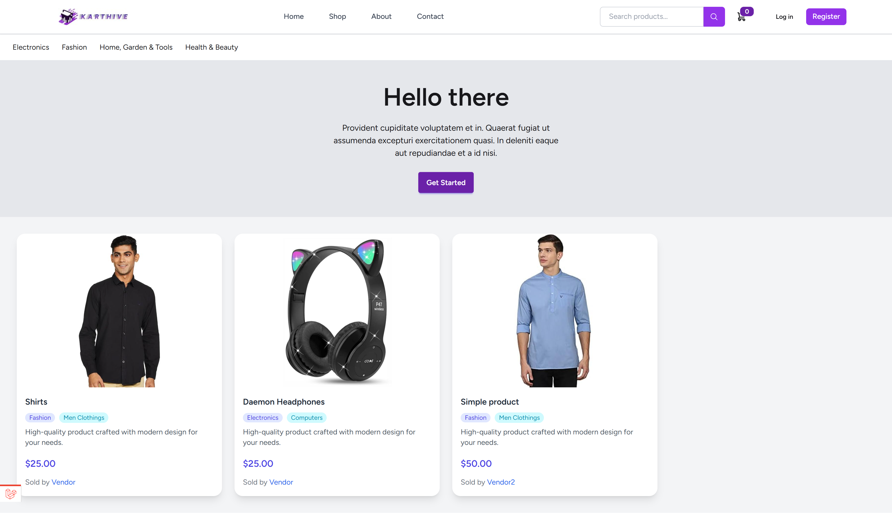

##### 🏠 Home Page After Login
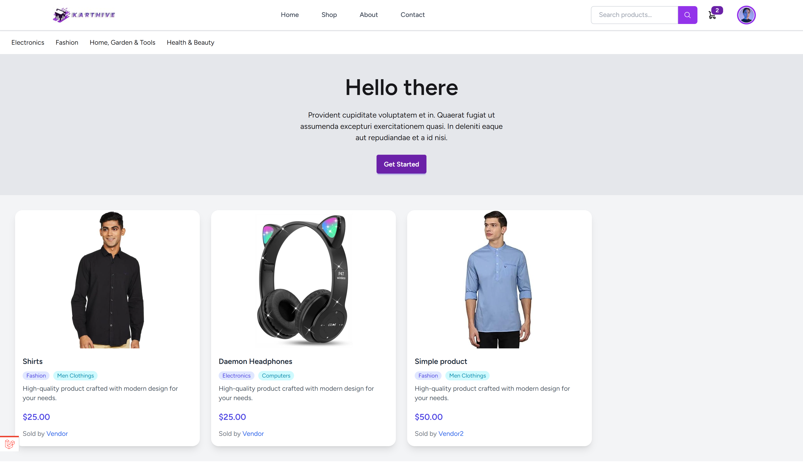


#### 🛍️ Shop & Product Screens

##### 🛍️ Shop Page
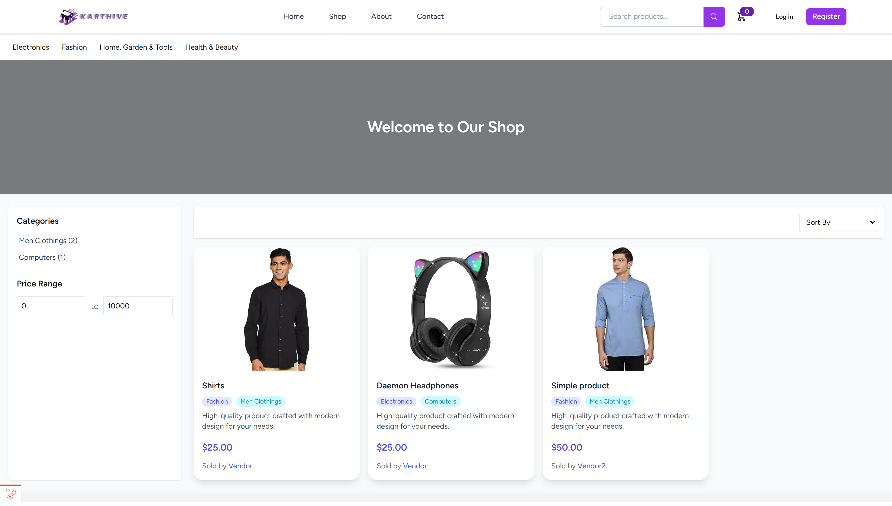 

##### 📄 Product Detail Page
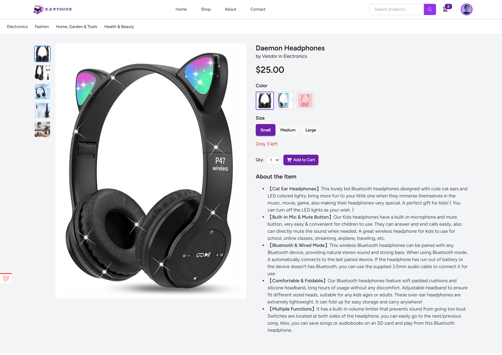

##### 🛒 Cart Page
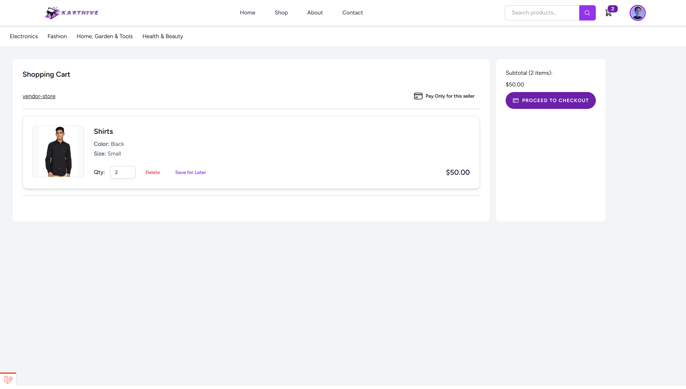


#### 👤 User Panel

##### 👤 User Profile
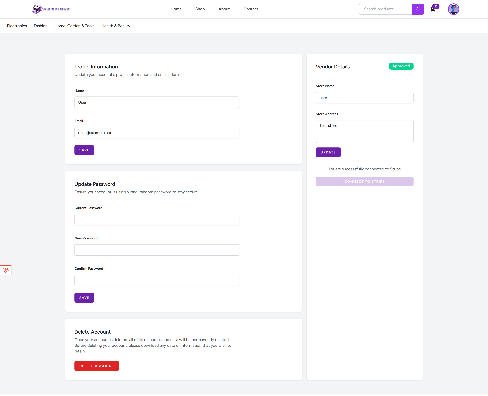


#### 🛠️ Admin Panel

##### 🗂️ Department List
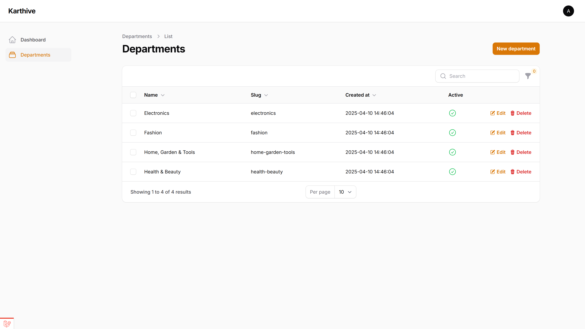

##### 📝 Department Edit + Category Management


#### 🧑‍💼 Vendor Panel

##### 🧾 Product List
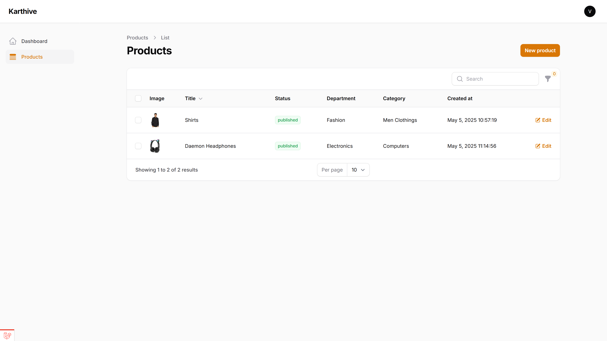

##### 🖼️ Product Image Upload
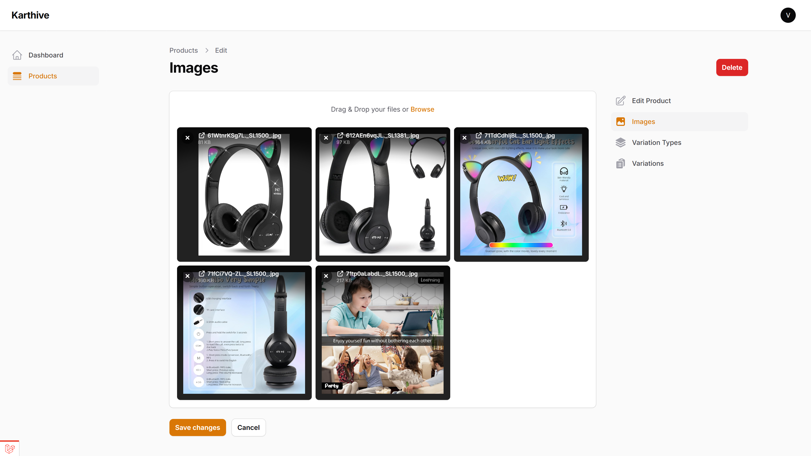

##### 🔀 Variation Types Management
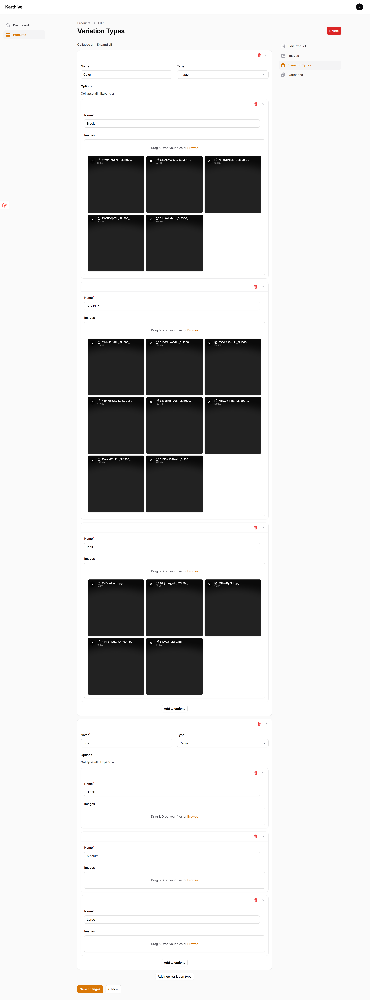

##### 🔁 Product Variations
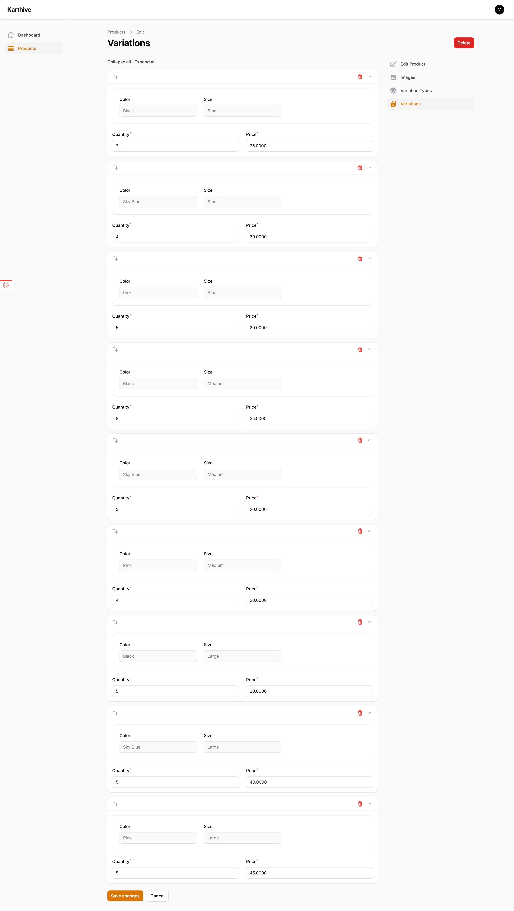


